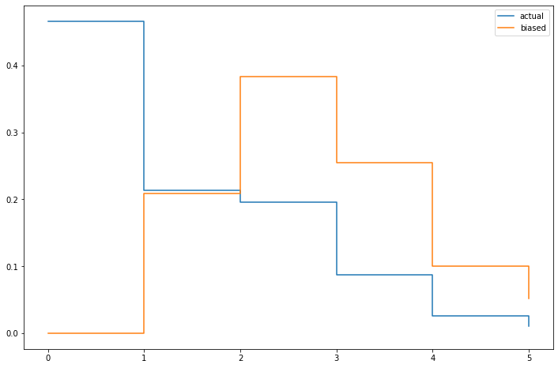

[Think Stats Chapter 2 Exercise 4](http://greenteapress.com/thinkstats2/html/thinkstats2003.html#toc24) (Cohen's d)

```python
# *calculating biased PMF of number of kids if children are surveyed* 
num_kids_biased=num_kids*num_kids.index
obs=num_kids_biased.sum()
nkb_pmf=num_kids_biased/obs
#calculating the mean of biased distribution
print ((nkb_pmf*nkb_pmf.index).sum())
print (nkb_pmf)
```


