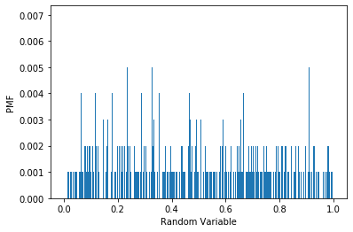
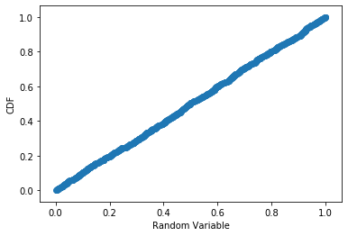

[Think Stats Chapter 4 Exercise 2](http://greenteapress.com/thinkstats2/html/thinkstats2005.html#toc41) (a random distribution)

Exercise: The numbers generated by numpy.random.random are supposed to be uniform between 0 and 1; that is, every value in the range should have the same probability.

Generate 1000 numbers from numpy.random.random and plot their PMF. What goes wrong?

Now plot the CDF. Is the distribution uniform?

```python
import matplotlib.pyplot as plt 
import numpy as np
t=np.random.random(1000)
t_hist=plt.hist(t, bins=1000, weights=[0.001]*1000, range=[0,1])
plt.xlabel("Random Variable")
plt.ylabel("PMF")
plt.show()
t_list=list(t)
def cdf(sample, x):
    count = 0.0
    for value in sample:
        if value <= x:
            count += 1

    prob = count / len(sample)
    return prob
cdf_list=[cdf(t_list, ran) for ran in t_list]
plt.scatter(x=t_list, y=cdf_list)
plt.xlabel('Random Variable')
plt.ylabel('CDF')
```




