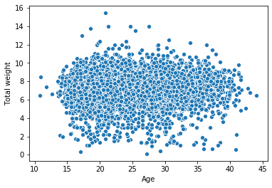
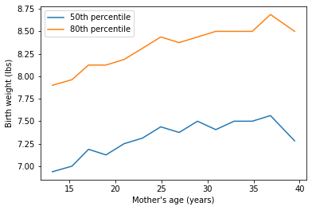

[Think Stats Chapter 7 Exercise 1](http://greenteapress.com/thinkstats2/html/thinkstats2008.html#toc70) (weight vs. age)

```python 

import first

live, firsts, others = first.MakeFrames()
live = live.dropna(subset=['agepreg', 'totalwgt_lb'])```python
import matplotlib.pyplot as plt 
import seaborn as sns

sns.scatterplot(x=live['agepreg'], y=live ['totalwgt_lb'])
plt.ylabel('Total weight')
plt.xlabel( 'Age' )
plt.show()
```


```python
bins = np.arange(14,40, 2)
indices = np.digitize(live.agepreg, bins)
age = live.groupby(indices)['agepreg'].mean()
perc_weight_50=live.groupby(indices)['totalwgt_lb'].quantile(0.5)
plt.plot(age, perc_weight_50, label = '50th percentile')
perc_weight_80=live.groupby(indices)['totalwgt_lb'].quantile(0.8)
plt.plot(age, perc_weight_80, label = '80th percentile')
plt.xlabel("Mother's age (years)")
plt.ylabel('Birth weight (lbs)')
plt.legend()
```



